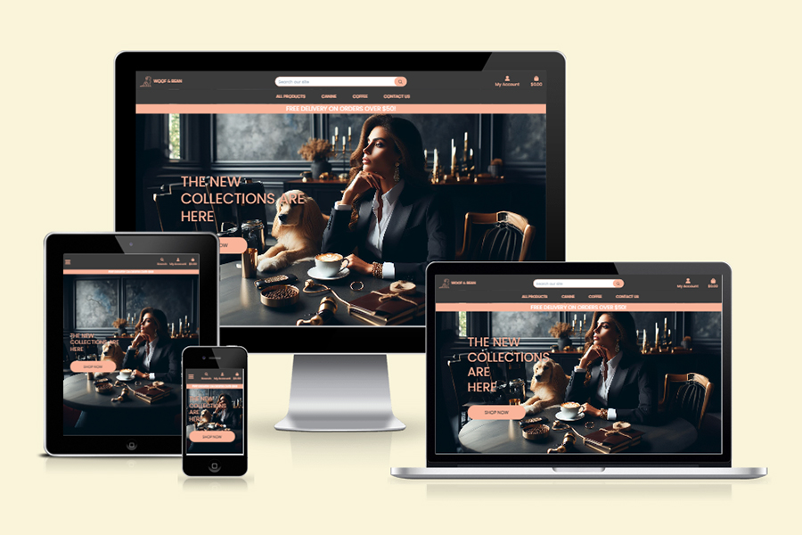
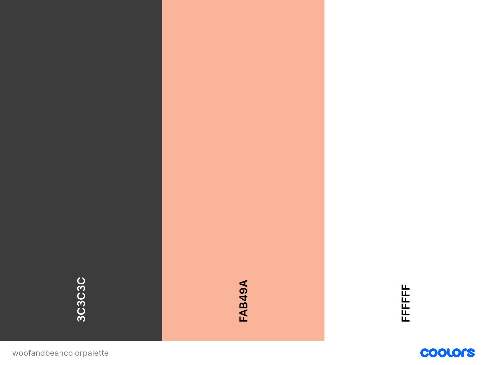
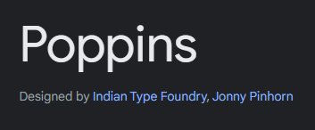

# [View The Live Project Here](https://woof-and-bean-ci-m4-3f6e86d7432d.herokuapp.com/)

## Woof and Bean

Woof and Bean is a coffee and dog lovers' e-commerce website. Users can purchase various coffee-related paraphernalia and the perfect toy or treat for their special canine friend all in one place. By browsing via specific categories and using sorting filters such as name, date added, and category, as well as searching for keywords, the user can quickly find exactly what they are looking for. The basic functionality of the site comprises the user being able to register for a private account, log in and out, create orders by paying via Stripe, and receive confirmation emails when the order is created. Additional functionality has been added to the user experience, and these details will be discussed further in this document.

## User Experience (UX)
### Project Goals

The goal of Woof and Bean is to provide a functional e-commerce experience to simulate the ability for users to browse products, add them to the cart, check out, receive order confirmation emails, and have a record of past orders within their account.

* When developing Woof and Bean, the main goal was to improve upon the basic functionality as outlined above in this document and enhance the user experience further. The additional functionality is as follows:
Users can easily create and edit a private wishlist while still being able to add the products directly to their shopping cart from the wishlist itself.
    * A contact form for the user to be able to contact the site admins with queries, issues, or suggestions, and then receive an email confirmation that their message was successfully sent.
* Accessibility was at the forefront of design and development. Using a contrasting colour palette ensures the site is easily accessible to users regardless of abilities, making the experience more enjoyable for all.

### User Stories
#### Viewing and Navigation
* View the website on a range of device sizes and have it be aesthetically pleasing and functional.
* View a range of coffee and dog products for sale.
* View individual product details.
* Easily view the total of my purchases at any time.
* View what products (if any) are on my wishlist
* View past order details on my profile
#### Registration and User Accounts
* Easily register for an account
* Easily log in or log out
* Easily recover my password in case I forget it
* Receive an email confirmation after registering
* Have a personalised user profile
* Be able to easily contact the site owners and receive confirmation of my message
#### Sorting and Setting
* Sort the list of available Products
* Sort by specific category of Product
* Search for a product by title or specific words in product details
* Easily see what I've searched for and the number of results found
* Be shown on a product details page whether a particular product is on my wishlist or not
#### Purchasing and Checkout
* Easily select the quantity of a product when purchasing it
* View items in my bag to be purchased
* Adjust the number of individual items in my bag
* Easily enter my payment information
* Feel my personal and payment information is safe and secure
* View an order confirmation after checkout
* Receive an email confirmation after checking out
#### Admin and Store Management
* Add products
* Edit/update products
* Delete products

## Design
### Colour Scheme

The colour scheme of Woof and Bean is primarily comprised of Onyx, White, and Peach.

* The background is Onyx to ensure the site is not bright and harsh on the eyes of the user when browsing products.
* The site text is predominately White and Peach, to ensure readability but also to provide enough contrast with the Onyx background matching the brand logo colours.
* The Choice of colours chosen along with eye strain and readability in mind matches that of the company logo invoking a premium or luxury feeling.

### Typography

[Google Fonts](https://fonts.google.com/) Was used to import the font featured on the site. The Font used is of the type sans-serif for consistency.

* I adjusted the Stripe element font to use "Poppins" to bring it in line and consistent with the rest of the website typography.

* I chose the "Poppin" font for both the header and body of the site to keep a consistent and legible font throughout. Utilising Uppercase and bold font weights to highlight headers and important information for the user to pay attention to.

### Icons and Images

* All icons used throughout the site were provided by [FontAwesome](https://fontawesome.com/) as their style is aesthetically pleasing while being consistent and easily understandable
* I sourced an icon from [Flaticon](https://www.flaticon.com) that will be attributed in the credits section of this document. I then used [Favicon](https://favicon.io/) to convert this png to an icon file and imported that to my site. I installed a Favicon to help users distinguish this tab from others in their browser, the simple book-related design and bright colours help to do this.
* All product images will be attributed in the credits section, along with the hero image on the home page.
* The home page image serves to provide an aesthetically pleasing and colourful element to the page while making clear that this site is a bookshop.

bug - NoReverseMatch at /profile/whishlist/ when trying to include html for mobile wishlist view
        fix = putting mobile includes inside forloop for wishlist items

bug - after refactoring shopping basket code for mobile devices increment and decrement buttons would allow users to decrement and increment bellow 1 and above 99
    Fix = Change Id's to classes for quantity form and adjusted JS to look for class elements.

bug - Server error 500 when signing up for account - fix = create runtime.txt with older version of python for heroku to use

bug - stripe webhooks failing. - Fix added missin / to the end of the webhook name

Bug - logo image not loading after heroku deployment - fix: Adjusted image src link for AWS hosting
src="https://woof-and-bean-ci-m4.s3.amazonaws.com/media/wblogo.png"

Search bar icon inside input on the right helped by Slack London community

8 products per category

singals instances create and save

set up ready signals in apps.py import signals to activate

Add items to wishlist - using add item to bag views.py code as a base?

Add a contact model custom model 2

## User Stories

### As A/An Shopper
    - **Viewing and Navigation**

        | I Want To Be Able To...                                    | So That I Can...                                                                   | 
        |------------------------------------------------------------|------------------------------------------------------------------------------------| 
        | View a list of products                                    | Select some to purchase                                                            | 
        | View individual product details                            | Identify the price, description, product rating,  product image and available sizes |
        | Quickly identify deals,  clearance items and special offers | Take advantage of special savings on products  I'd like to purchase |
        | Easily view the total of my purchases at any time          | Avoid spending too much |

    - **Sorting and Searching**
        
        | I Want To Be Able To...                                    | So That I Can...                                                                   | 
        |------------------------------------------------------------|------------------------------------------------------------------------------------|
        | Sort the list of available products                        | Easily identify the best rated, best priced and  categorically sorted products |
        | Sort a specific category or products                       | Find the best-priced or best-rated product in a  specific category, or sort the products in that  category by name |
        | Sort multiple categories of products simultaneously        | Find the best-priced or best-rated products across  broad categories, such as "Treats" or "Accessories" |
        | Search for a product by name or description                | Find a specific product I'd like to purchase |
        | Easily see what I've searched for and the number of  results | Quickly decide whether the product I want is available |

    - **Purchasing and Checkout**
        
        | I Want To Be Able To...                                    | So That I Can...                                                                   | 
        |------------------------------------------------------------|------------------------------------------------------------------------------------|
        | Easily select the size and quantity of a product  when purchasing it | Ensure I dont accidentally select the wrong product,  quantity or size |

### As A/An Site User
    - **Registration and User Accounts**

        | I Want To Be Able To...                                    | So That I Can...                                                                   | 
        |------------------------------------------------------------|------------------------------------------------------------------------------------|
        | Easily register for an account | Have a personal account and be able to view my profile |
        | Easily login or logout | Access my personal account information |
        | Easily recover my password in case I forget it | Recover access to my account |
        | Receive an email confirmation after registering | Verfify that my account registration was successful |
        | Have a personalized user profile | View my personal order history, order confirmations  and save my personal information |

# Product Model
    "category" - Product category ForeignKey
    "sku" - product sku
    "name" - product name
    "description" - product description
    "price" - product price
    "rating" - product rating
    "image url" - product image url
    "image" - product image

# Profiles Model
    user = models.OneToOneField(User, on_delete=models.CASCADE)
    default_phone_number = models.CharField(max_length=20, null=True, blank=True)
    default_street_address1 = models.CharField(max_length=80, null=True, blank=True)
    default_street_address2 = models.CharField(max_length=80, null=True, blank=True)
    default_town_or_city = models.CharField(max_length=40, null=True, blank=True)
    default_county = models.CharField(max_length=80, null=True, blank=True)
    default_postcode = models.CharField(max_length=20, null=True, blank=True)
    default_country = CountryField(blank_label='Country', null=True, blank=True)

# Category Model
    "name" - category name PrimaryKey
    "friendly_name" - friendly name for front end

# wishlist Model
    "User" - One to One field - User
    "products" - Many to Many field - Product
    "created" - date time field

# rating Model
    star choices 1,1 - 2,2 - 3,3 - 4,4 - 5,5
    "User" - foreignkey
    "product" - foreignkey
    "order" - foreignkey
    "rating" - charfield - 1-5 stars

# Order checkout Model
     order_number = models.CharField(max_length=32, null=False, editable=False)
    user_profile = models.ForeignKey(UserProfile, on_delete=models.SET_NULL,
                                     null=True, blank=True, related_name='orders')
    full_name = models.CharField(max_length=50, null=False, blank=False)
    email = models.EmailField(max_length=254, null=False, blank=False)
    phone_number = models.CharField(max_length=20, null=False, blank=False)
    country = CountryField(blank_label='Country *', null=False, blank=False)
    postcode = models.CharField(max_length=20, null=True, blank=True)
    town_or_city = models.CharField(max_length=40, null=False, blank=False)
    street_address1 = models.CharField(max_length=80, null=False, blank=False)
    street_address2 = models.CharField(max_length=80, null=True, blank=True)
    county = models.CharField(max_length=80, null=True, blank=True)
    date = models.DateTimeField(auto_now_add=True)
    delivery_cost = models.DecimalField(max_digits=6, decimal_places=2, null=False, default=0)
    order_total = models.DecimalField(max_digits=10, decimal_places=2, null=False, default=0)
    grand_total = models.DecimalField(max_digits=10, decimal_places=2, null=False, default=0)
    original_bag = models.TextField(null=False, blank=False, default='')
    stripe_pid = models.CharField(max_length=254, null=False, blank=False, default='')

# Font/Typeface
    Poppins - Googlefonts
